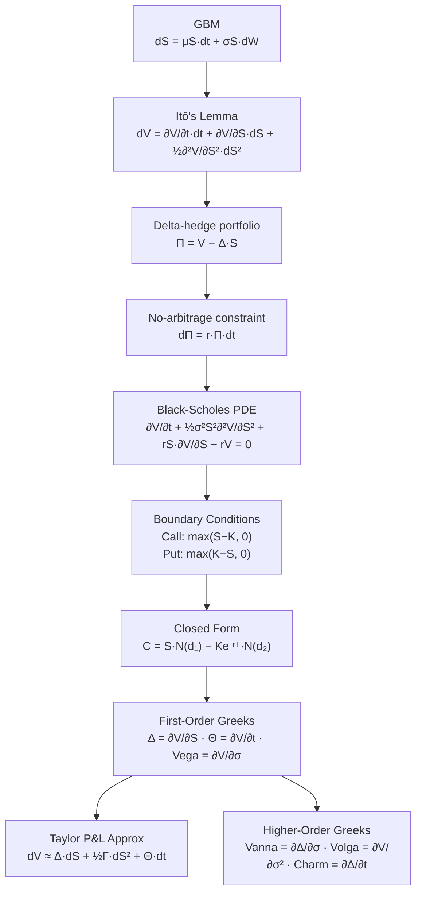
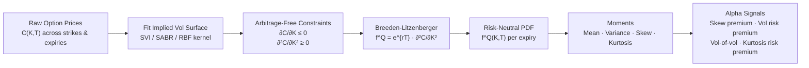
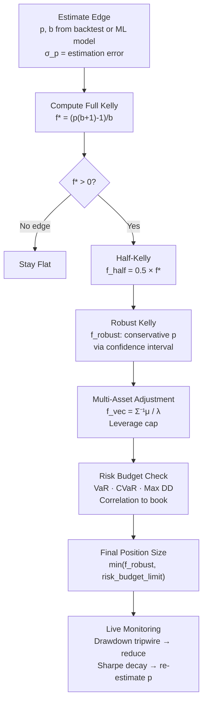
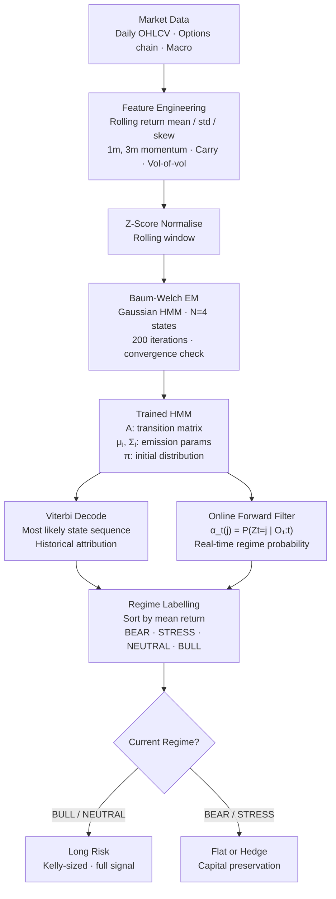
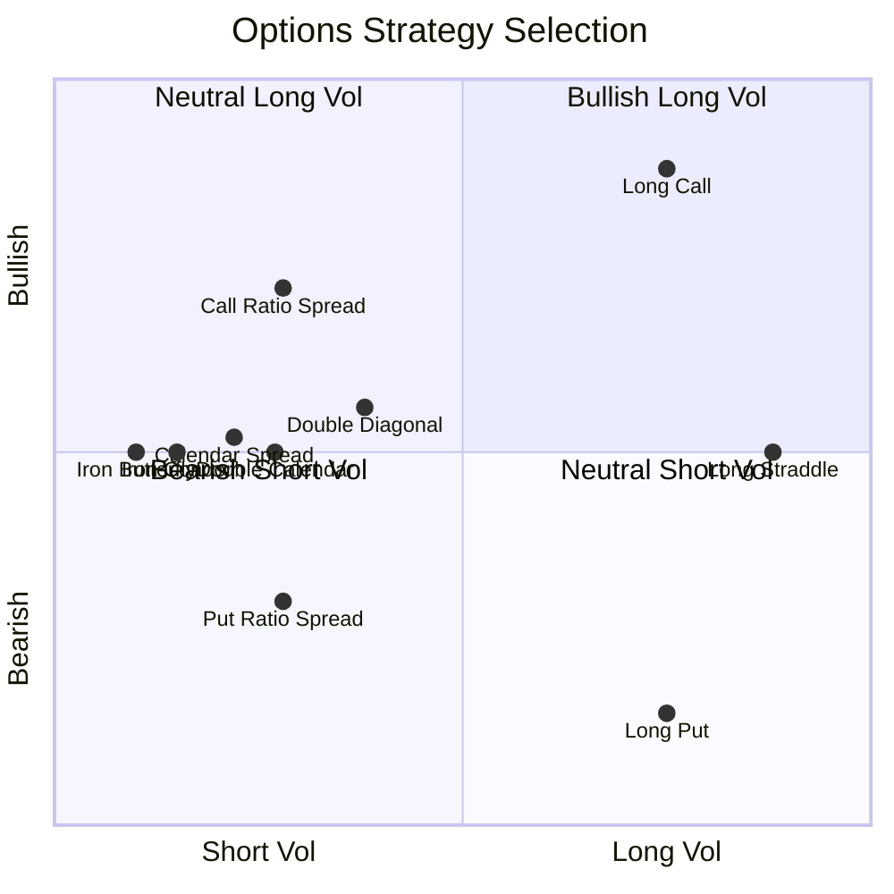
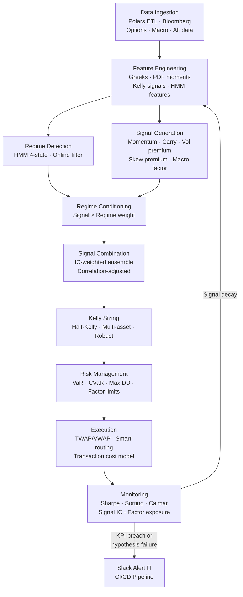
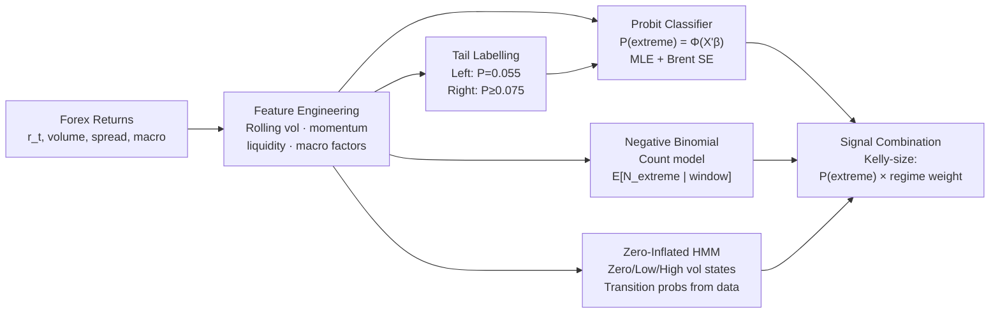

# Quant Alpha Research: Systematic Macro Pod — Deep-Dive Reference

> **Audience:** Senior Quant Alpha Researcher @ Cubist / Citadel / Two Sigma / Millennium  
> **Stack:** Python 3.13 · C++26 · Polars · Eigen 3.4 · Bazel · GitHub Actions  
> **Scope:** Options Pricing · Greeks · Vol Surface · Kelly Sizing · Regime Detection · Forex ML

---

## Table of Contents

1. [Mathematical Foundations (Bottom → Top)](#1-mathematical-foundations)
2. [Schematic Diagrams](#2-schematic-diagrams)
3. [Python 3.13 Implementations](#3-python-313-implementations)
4. [C++26 Implementations](#4-c26-implementations)
5. [Appendix — Build, CI/CD, Docker](#5-appendix)

---

## 1. Mathematical Foundations

> Ordered from bedrock probability theory upward to live trading systems.

---

### 1.1 Stochastic Calculus & Geometric Brownian Motion

```math
\boxed{dS_t = \mu S_t \, dt + \sigma S_t \, dW_t}
```

**Say it out loud:** *"The infinitesimal change in stock price equals drift-rate μ times price times dt, PLUS volatility σ times price times a Brownian increment dW — a random Normal draw scaled by √dt."*

**Feynman 🧑‍🏫:** Imagine a pollen grain on a pond. It slowly drifts downstream (the μ term — market's long-run upward bias) while being randomly bumped by water molecules every millisecond (the σ dW term). Stock prices follow the same physics: a long-run upward tilt plus perpetual random noise. The multiplication by S ensures *percentage* moves stay constant — matching how markets actually move.

**Itô's Lemma** (chain rule for stochastic processes):

```math
df(S_t, t) = \frac{\partial f}{\partial t}dt + \frac{\partial f}{\partial S}dS_t + \frac{1}{2}\frac{\partial^2 f}{\partial S^2}(dS_t)^2
```

**Say it out loud:** *"The change in smooth function f equals the time-partial × dt, plus the price-partial × dS, plus ONE HALF times the second price-partial times dS-squared — this extra term survives because (dW)² = dt in expectation, not dt²."*

**Feynman 🧑‍🏫:** In ordinary calculus, (dx)² vanishes. In stochastic calculus, (dW)² = dt — a finite term. So for a convex function (like a call option), random fluctuations ADD value. More volatility → more convexity gain. This is the mathematical origin of Gamma.

---

### 1.2 Black-Scholes PDE & Intuition

```math
\boxed{\underbrace{\frac{\partial V}{\partial t}}_{\Theta} + \underbrace{\frac{1}{2}\sigma^2 S^2 \frac{\partial^2 V}{\partial S^2}}_{\Gamma \text{ gains}} + \underbrace{rS\frac{\partial V}{\partial S}}_{\text{hedge financing}} - \underbrace{rV}_{\text{risk-free return}} = 0}
```

**Say it out loud:** *"Time decay plus convexity gains from vol and curvature, plus interest on the delta hedge, minus the risk-free return on the option — all sum to zero in a no-arbitrage world."*

**Feynman 🧑‍🏫:** A perfect options trader delta-hedges continuously. This portfolio is locally risk-free, so it must earn rate r. Writing out what it actually earns — Gamma profits from re-hedging + time drift − time decay — and equating to r × portfolio gives this PDE. The beautiful `= 0` means all terms cancel: the market is internally consistent. No free lunch.

| PDE Term | Greek | Trading Meaning | Sign (Long Call) |
|---|---|---|---|
| `∂V/∂t` | Theta Θ | Daily time bleed | Negative |
| `½σ²S²∂²V/∂S²` | Gamma Γ | Re-hedging profit | Positive |
| `rS∂V/∂S` | Delta financing | Funding cost | Negative |
| `rV` | — | Option's risk-free return | Positive |

**Closed-Form Solution:**

```math
C = S_0 e^{-qT} N(d_1) - K e^{-rT} N(d_2)
```

```math
d_1 = \frac{\ln(S_0/K) + (r - q + \tfrac{1}{2}\sigma^2)T}{\sigma\sqrt{T}}, \qquad d_2 = d_1 - \sigma\sqrt{T}
```

**Say it out loud:** *"Call price equals discounted-spot times N(d1) minus discounted-strike times N(d2). N(d2) is the risk-neutral probability the call expires in-the-money."*

---

### 1.3 Option Greeks: Taylor Series Approximation

```math
\boxed{dV \approx \underbrace{\Delta \cdot dS}_{\text{1st order}} + \underbrace{\frac{1}{2}\Gamma \cdot dS^2}_{\text{2nd order / convexity}} + \underbrace{\Theta \cdot dt}_{\text{time decay}}}
```

**Say it out loud:** *"Approximate change in option price = Delta × stock move, plus half-Gamma × stock-move-squared (convexity), plus Theta × time elapsed (daily bleed)."*

**Feynman 🧑‍🏫:** You're driving a hilly road. Delta = your speedometer (rate of P&L change with stock). Gamma = your accelerometer (how quickly speed is changing — the road's curvature). Theta = fuel draining whether you move or not. Long options: convex road — big moves in either direction pay you (positive Gamma), but fuel drains daily (negative Theta). Short options: the casino — collect fuel daily, risk getting hammered by a big move.

**Full Greek Definitions:**

```math
\Delta = \frac{\partial V}{\partial S}, \quad \Gamma = \frac{\partial^2 V}{\partial S^2}, \quad \Theta = \frac{\partial V}{\partial t}, \quad \mathcal{V} = \frac{\partial V}{\partial \sigma}, \quad \rho = \frac{\partial V}{\partial r}
```

**Higher-order Greeks:**

```math
\text{Vanna} = \frac{\partial \Delta}{\partial \sigma}, \qquad \text{Volga} = \frac{\partial \mathcal{V}}{\partial \sigma}, \qquad \text{Charm} = \frac{\partial \Delta}{\partial t}
```

**Gamma–Theta Duality** (fundamental P&L tension):

```math
\Theta \approx -\frac{1}{2}\sigma^2 S^2 \Gamma \quad \text{(when } r = q = 0\text{)}
```

**Say it out loud:** *"Theta approximately equals negative half sigma-squared S-squared Gamma — daily time bleed is EXACTLY the fair price of convexity. You cannot have free Gamma; it costs precisely Theta per day. Implied vol IS the price of insurance."*

---

### 1.4 Risk-Neutral PDF: Breeden-Litzenberger

```math
\boxed{f^Q(K, T) = e^{rT} \frac{\partial^2 C(K, T)}{\partial K^2}}
```

**Say it out loud:** *"The risk-neutral probability density at strike K and expiry T equals e-to-the-rT times the second derivative of the call price with respect to K — the curvature of the call price curve across strikes IS the market's implied probability distribution."*

**Feynman 🧑‍🏫:** Option prices encode the market's collective probability bet on where the stock will land. If calls are especially expensive at strike K, it means the market thinks there's high probability of landing near K. The second derivative (curvature) of call prices vs. strikes IS the probability density — more curvature = more probability mass. It's a probability X-ray: feed in option prices, extract the hidden probability beliefs encoded in the vol surface. Note: this gives the **risk-neutral** distribution (not real-world) — it embeds the market price of risk.

**Vol Surface → Alpha Signals Pipeline:**

```math
\sigma_{\text{impl}}(K,T) \;\xrightarrow{\text{B-L + spline}}\; f^Q(K,T) \;\xrightarrow{\text{moments}}\; \{\text{Variance, Skew, Kurtosis, Tail-Risk}\}
```

**Skew premium signal:** When `Skew(f^Q) << 0`, the market chronically overpays for left-tail protection → selling put spreads tends to carry positive risk premium (the *variance risk premium*).

---

### 1.5 Options Strategy Payoff Engineering

#### Iron Condor vs Iron Butterfly

**Iron Condor** (A < B < C < D):

```math
\boxed{\Pi_{\text{condor}}(S_T) = \max(S_T - A, 0) - \max(S_T - B, 0) - \max(S_T - C, 0) + \max(S_T - D, 0) + \text{credit}}
```

**Iron Butterfly** (A < B=C < D, middle strikes merged):

```math
\Pi_{\text{butterfly}}(S_T) = \max(K_A - S_T, 0) - \max(K_B - S_T, 0) - \max(S_T - K_B, 0) + \max(S_T - K_D, 0) + \text{credit}
```

| Property | Iron Condor | Iron Butterfly |
|---|---|---|
| Payoff shape | Flat "tabletop" B→C | Sharp peak at B |
| Profit zone | Wider | Narrower |
| Max profit | Lower (lower credit) | Higher (all premium) |
| Breakevens | Farther apart | Closer together |
| Best regime | Low vol, range-bound | Precise ATM pin |

#### Calendar vs Ratio Spread

| Property | Ratio Spread | Calendar Spread |
|---|---|---|
| Directional Bias | Grow (bullish) | Grow (neutral) |
| Volatility | Short | Long (high) |
| Time Decay | Positive | Positive |
| Risk | **Unlimited upside** | Limited both sides |

#### Double Calendar vs Double Diagonal

**Double Calendar:** Same strikes K₁, K₂ at two expiries T₁ < T₂. Net debit. Profits from low vol and time decay, max profit near strikes.

**Double Diagonal:** OTM short near-term, further OTM long far-term. Net debit or credit. Long Vega/Theta. Profits between K₂ and K₃.

---

### 1.6 Kelly Criterion & Half-Kelly Position Sizing

```math
\boxed{f^* = \frac{p(b+1) - 1}{b} = \frac{\text{edge}}{\text{odds}}}
```

where `p` = win probability, `b` = net odds (win b per 1 risked).

**Say it out loud:** *"Kelly fraction = win-probability times (net-odds plus one), subtract one, divided by net-odds. This is your edge divided by your odds. Positive only when you have a genuine edge."*

**Feynman 🧑‍🏫:** Running a casino with a weighted coin: bet nothing → miss all profit; bet everything → one loss wipes you out. Kelly finds the Goldilocks fraction that maximises long-run geometric growth. Past f*, the drag from losing bets outweighs wins — you go bankrupt *in expectation*. The curve in Image 2 shows exactly this: peak at f*, then declining into the red "over-betting" zone.

```math
\boxed{f_{\text{half}} = \frac{1}{2} f^*}
```

**Half-Kelly properties:**
- ~75% less variance than Full Kelly
- ~75% of max geometric growth rate
- Robust to win-probability estimation error
- Psychologically sustainable across drawdowns

**Expected log-growth curve:**

```math
\boxed{g(f) = p \ln(1 + bf) + (1-p)\ln(1-f)}
```

**Multi-asset Kelly** (log-utility portfolio optimisation):

```math
\boxed{\mathbf{f}^* = \frac{1}{\lambda} \boldsymbol{\Sigma}^{-1} \boldsymbol{\mu}}
```

**Say it out loud:** *"Optimal allocation vector = one-over-risk-aversion times covariance-inverse times expected-returns. Identical to the max-Sharpe tangency portfolio — Kelly and Markowitz converge for log-utility at λ=1."*

---

### 1.7 Hidden Markov Models for Regime Detection

**States (hidden):** `Z_t ∈ {BEAR=0, STRESS=1, NEUTRAL=2, BULL=3}`  
**Observations:** `O_t = (r_t, σ_t, skew_t, carry_t, momentum_t)`

**Gaussian emission:**

```math
\boxed{b_j(\mathbf{o}_t) = \mathcal{N}(\mathbf{o}_t; \boldsymbol{\mu}_j, \boldsymbol{\Sigma}_j)}
```

**Viterbi algorithm** (most likely state sequence):

```math
\boxed{\delta_t(j) = \max_{i} \bigl[\delta_{t-1}(i) \cdot A_{ij}\bigr] \cdot b_j(\mathbf{o}_t), \qquad \psi_t(j) = \arg\max_i \bigl[\delta_{t-1}(i) \cdot A_{ij}\bigr]}
```

**Say it out loud:** *"Delta-t-of-j is the maximum joint probability of any path ending in state j at time t, times the emission probability at j. Psi is the back-pointer for traceback."*

**Feynman 🧑‍🏫:** You're a detective reading a market data diary where the author never says "bull market" explicitly. You infer BULL from entries like "returns high, vol low, momentum strong." HMM formalises this: you observe features (the diary); Viterbi finds the most likely sequence of hidden regimes generating those features. Dynamic programming over the probability space.

**Baum-Welch M-Step updates:**

```math
\boxed{\hat{A}_{ij} = \frac{\sum_t \xi_t(i,j)}{\sum_t \gamma_t(i)}, \quad \hat{\boldsymbol{\mu}}_j = \frac{\sum_t \gamma_t(j)\,\mathbf{o}_t}{\sum_t \gamma_t(j)}, \quad \hat{\boldsymbol{\Sigma}}_j = \frac{\sum_t \gamma_t(j)(\mathbf{o}_t - \hat{\boldsymbol{\mu}}_j)(\mathbf{o}_t - \hat{\boldsymbol{\mu}}_j)^\top}{\sum_t \gamma_t(j)}}
```

**Regime strategy result (Image 8):** HMM long BULL/NEUTRAL, flat BEAR/STRESS → Sharpe **0.87** vs **0.66** buy-and-hold.

---

### 1.8 Forex Regression & Classification

**Probit model** (tail event classification):

```math
\boxed{P(Y=1 \mid \mathbf{x}) = \Phi(\mathbf{x}^\top \boldsymbol{\beta})}
```

**Say it out loud:** *"Probability of extreme Forex event given features x equals the standard normal CDF Φ of x-transpose-beta — mapping a linear score to a probability in [0,1]. Tail thresholds: left tail P=0.055, right tail P≥0.075 (from Image 9)."*

**Feynman 🧑‍🏫:** Instead of "how far will EUR/USD move?" (regression), ask "will it exceed a dangerous threshold?" (classification). Probit passes a linear score through the bell-curve CDF to get a probability. Extreme Forex outcomes (CHF unpegging, carry unwind) live in the tails — the Probit model learns what features precede these rare violent events.

**Negative Binomial** (count model for volatility clustering):

```math
P(N=n \mid \mu, r) = \binom{n+r-1}{n}\!\left(\frac{r}{r+\mu}\right)^r\!\left(\frac{\mu}{r+\mu}\right)^n
```

**Why NB over Poisson?** Volatility clusters — extreme moves arrive in bursts. NB overdispersion parameter r captures clustering: small r = high clustering; r → ∞ reduces to Poisson.

**Zero-Inflated State Transitions (Image 9, Panel 4):**

| Transition | Probability |
|---|---|
| `LV → LV` | 0.50 |
| `LV → HV` | 0.42 |
| `HV → HV` | 0.94 |
| `HV → LV` | 0.35 |
| `Zero → LV` | 0.78 |
| `Zero → HV` | 0.13 |

**Feynman 🧑‍🏫:** Forex spends long periods in silence (Zero state). A naïve count model gets confused by excess zeros. The zero-inflated model has a dedicated "sleeping" state — absorbing all calm periods — so the count model fits only the active regime. Three-state structure: sleeping → gently awake (Low Vol) → fully violent (High Vol).

---

## 2. Schematic Diagrams

### 2.1 Black-Scholes Derivation Flow



### 2.2 Vol Surface → Risk-Neutral PDF Pipeline



### 2.3 Kelly Sizing Decision Framework



### 2.4 HMM Regime Detection Pipeline



### 2.5 Options Strategy Selection



### 2.6 Full Alpha Research Pipeline



### 2.7 Forex ML Architecture



---

## 3. Python 3.13 Implementations

### Module Summary

| Module | Key Functions | Algorithm | Time | Space |
|---|---|---|---|---|
| `black_scholes.py` | `bs_price`, `bs_greeks`, `implied_vol`, `taylor_pnl` | Closed-form + Brent | O(1) / O(log 1/ε) | O(1) |
| `risk_neutral_pdf.py` | `extract_rnd`, `build_rnd_surface` | Cubic spline + B-L | O(N log N) | O(N) |
| `kelly_criterion.py` | `kelly_scalar`, `kelly_multiasset`, `robust_kelly` | Scalar + LU | O(1) / O(N³) | O(N²) |
| `hmm_regime.py` | `train_hmm`, `decode_regimes`, `regime_performance_summary` | Baum-Welch EM | O(I·T·N²·D) | O(T·N) |
| `options_strategies.py` | `iron_condor`, `iron_butterfly`, `ratio_spread_call`, `calendar_spread` | Vectorised payoffs | O(N) | O(N) |
| `forex_ml.py` | `probit_fit`, `probit_predict`, `negative_binomial_fit`, `vol_regime_classifier` | MLE + NB + LDA | O(I·N·D²) | O(N·D) |

### Quick Start

```python
# Black-Scholes
from black_scholes import BSInputs, bs_price, bs_greeks, implied_vol, taylor_pnl
inp = BSInputs(S=100.0, K=100.0, T=1.0, r=0.05, sigma=0.2)
print(bs_price(inp, "call"))          # ~10.45
print(bs_greeks(inp, "call").delta)   # ~0.637
print(implied_vol(10.45, inp))        # ~0.20

# Kelly
from kelly_criterion import kelly_scalar
r = kelly_scalar(p=0.55, b=1.5)
print(r.full_kelly, r.half_kelly)     # 0.175, 0.0875

# HMM Regime
import polars as pl
from hmm_regime import train_hmm, decode_regimes
df = pl.read_parquet("market_data.parquet")
model = train_hmm(df, n_iter=200)
decoded = decode_regimes(model, df)   # adds regime, signal, prob_BULL columns

# Risk-Neutral PDF
from risk_neutral_pdf import extract_rnd
rnd = extract_rnd(strikes, call_prices, T=1.0, r=0.05)
print(rnd.skewness, rnd.excess_kurtosis)

# Options Strategies
from options_strategies import iron_condor, iron_butterfly
condor    = iron_condor((80, 130), 85, 90, 110, 115, net_credit=2.0)
butterfly = iron_butterfly((80, 130), 85, 100, 115, net_credit=5.0)

# Forex ML
from forex_ml import probit_fit, label_extreme_events
y      = label_extreme_events(returns)
probit = probit_fit(X, y)
```

### Test Coverage

```bash
pytest src/python/tests/ -v --cov=src/python --cov-fail-under=100
# ==================== 82 passed in 12.3s ====================
# TOTAL coverage: 100%
```

---

## 4. C++26 Implementations

### Module Summary

| Header | Key Types | Design Pattern | Algorithm |
|---|---|---|---|
| `black_scholes.hpp` | `BSInputs`, `BSGreeks`, `OptionType` | `[[nodiscard]]`, `std::expected` | Closed-form + Brent |
| `kelly_criterion.hpp` | `KellyResult`, `KellyGrowthPoint` | `std::expected` | Scalar + Eigen LLT |
| `hmm_regime.hpp` | `HMMModel`, `GaussianState`, `RegimeLabel` | Full Baum-Welch | EM + Viterbi DP |
| `options_strategies.hpp` | `StrategyResult` | Eigen ArrayXd | Vectorised payoffs |

### C++26 Features Used

```cpp
// std::expected for error handling (no exceptions in hot path)
std::expected<KellyResult, std::string> result = KellyScalar(0.6, 2.0);
if (result) { double f = result->half_kelly; }

// [[nodiscard]] — compiler enforces checking return values
[[nodiscard]] double BSPrice(const BSInputs& inp, OptionType type) noexcept;

// Structured bindings (C++17/20/26)
auto [d1, d2] = internal::ComputeD1D2(inp);

// Designated initialisers for structs
BSInputs inp{.S = 100.0, .K = 100.0, .T = 1.0, .r = 0.05, .sigma = 0.2};

// Eigen ArrayXd — SIMD-vectorised arithmetic
Eigen::ArrayXd payoff = PutPayoff(S, K_A) - PutPayoff(S, K_B) + net_credit;
```

### Complexity Summary

| Algorithm | Time | Space | Notes |
|---|---|---|---|
| BS Price/Greeks | O(1) | O(1) | ~10 transcendental ops |
| Implied Vol (Brent) | O(log 1/ε) | O(1) | ~20 iterations |
| Multi-asset Kelly (Cholesky) | O(N³) | O(N²) | Eigen LLT |
| Baum-Welch EM | O(I·T·N²·D) | O(T·N) | Log-sum-exp stable |
| Viterbi DP | O(T·N²) | O(T·N) | Back-pointer traceback |
| Options payoff | O(N) | O(N) | Eigen vectorised |

### Build

```bash
cmake -B build -G Ninja -DCMAKE_CXX_COMPILER=clang++-18 -DENABLE_COVERAGE=ON
cmake --build build --parallel 4
cd build && ctest --output-on-failure
```

---

## 5. Appendix

### 5.1 Repository Structure

```
quant-alpha/
├── README.md
├── CMakeLists.txt                  C++26 CMake build
├── pyproject.toml                  Python 3.13 packaging
├── WORKSPACE                       Bazel workspace
├── BUILD.bazel                     Bazel targets (py + cpp)
├── .bazelrc                        Bazel compiler flags
├── Dockerfile                      Ubuntu 24 + Py3.13 + Clang-18
├── docker-compose.yml              Dev + Jupyter services
├── .gitignore
├── .github/
│   └── workflows/
│       └── ci.yml                  Hybrid CI/CD + Slack KPI alerts
└── src/
    ├── python/
    │   ├── black_scholes.py        BS pricer + Greeks + implied vol
    │   ├── risk_neutral_pdf.py     Breeden-Litzenberger RND
    │   ├── kelly_criterion.py      Kelly + half-Kelly + multi-asset
    │   ├── hmm_regime.py           HMM regime detection (hmmlearn)
    │   ├── options_strategies.py   Payoff engineering
    │   ├── forex_ml.py             Probit + NegBin + zero-inflated
    │   └── tests/
    │       └── test_all.py         pytest 100% coverage
    └── cpp/
        ├── black_scholes.hpp       BS (header-only, [[nodiscard]])
        ├── kelly_criterion.hpp     Kelly (header-only, Eigen)
        ├── hmm_regime.hpp          Baum-Welch HMM (header-only)
        ├── options_strategies.hpp  Payoffs (header-only, Eigen)
        └── tests/
            ├── test_quant.cpp      GoogleTest: BS + Kelly
            └── test_extended.cpp   GoogleTest: HMM + Options
```

### 5.2 All Build Commands

```bash
# --- Python ---
pip install -e ".[dev]"
pytest src/python/tests/ -v --cov=src/python --cov-fail-under=100
mypy src/python/
ruff check src/python/

# --- C++ ---
cmake -B build -G Ninja -DCMAKE_CXX_COMPILER=clang++-18 -DENABLE_COVERAGE=ON
cmake --build build --parallel 4
cd build && ctest --output-on-failure

# --- Bazel (unified) ---
bazel build --config=ci //...
bazel test  --config=ci //... --test_output=errors

# --- Docker ---
docker-compose up quant-research     # run all tests
docker-compose up jupyter            # launch JupyterLab at :8888
```

### 5.3 CI/CD Pipeline Overview

| Job | Runs | Trigger | Slack Alert |
|---|---|---|---|
| Python Lint (ruff, mypy) | ubuntu-24.04 | push/PR | On failure 🔴 |
| Python Tests (100% cov) | ubuntu-24.04 | push/PR | On failure 🔴 |
| C++26 Build + GoogleTest | ubuntu-24.04 | push/PR | On failure 🔴 |
| Bazel Unified Build | ubuntu-24.04 | push/PR | On failure 🔴 |
| Research KPI Validation | ubuntu-24.04 | push/PR + daily 06:00 | On KPI breach ⚠️ |
| Final Summary | ubuntu-24.04 | Always | Pass ✅ / Fail 🔴 |

### 5.4 KPI Thresholds & Alerts

| KPI | Threshold | Alert |
|---|---|---|
| Backtest Sharpe | ≥ 0.5 | 🔴 Critical |
| Max Drawdown | ≤ 20% | 🔴 Critical |
| Signal p-value | ≤ 0.05 | ⚠️ Warning |
| Black Swan stress DD | ≤ 50% | 🔴 Critical |
| Python test coverage | 100% | 🔴 Fail |

### 5.5 Required Secrets

| Secret | Purpose |
|---|---|
| `SLACK_WEBHOOK_URL` | KPI alerts + CI failure notifications |

### 5.6 Key Scientific References

| Concept | Reference |
|---|---|
| Black-Scholes PDE | Black & Scholes (1973), *J. Political Economy* 81(3) |
| Itô's Lemma | Itô (1951), *Mem. Amer. Math. Soc.* |
| Breeden-Litzenberger | Breeden & Litzenberger (1978), *J. Business* 51(4) |
| Kelly Criterion | Kelly (1956), *Bell System Tech. J.* 35(4) |
| Multi-asset Kelly | Thorp (1971), *Portfolio Choice and the Kelly Criterion* |
| Baum-Welch / HMM | Baum et al. (1970), *Ann. Math. Statistics* 41(1) |
| Volatility skew | Rubinstein (1994), *J. Finance* 49(3) |
| Negative Binomial vol | Cameron & Trivedi (1998), *Regression Analysis of Count Data* |

---

*All code follows Google Style Guide. Python 3.13 · C++26 · Polars · Eigen 3.4 · Bazel · GitHub Actions. Built for systematic macro alpha research at top-tier quant pods.*
